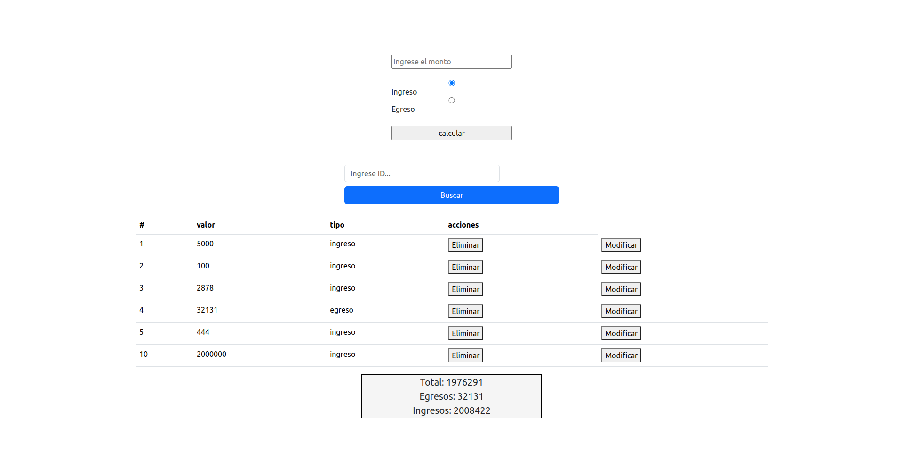

# Mi Gestor de Ingresos y Egresos
¡Bienvenido a Mi Gestor de Ingresos y Egresos! Este proyecto te permite llevar un registro de tus finanzas personales de manera sencilla. Fue creado utilizando HTML, CSS, y JavaScript, y es perfecto para practicar y mejorar tus habilidades en el desarrollo web.

## Motivación
Este proyecto tiene como objetivo principal brindarte la oportunidad de aprender, practicar y aplicar tus conocimientos en:

#### Manipulación del DOM: 
Aprenderás cómo modificar la interfaz de usuario de una página web de manera dinámica.

#### Peticiones HTTP:
 Entenderás cómo interactuar con servidores remotos a través de solicitudes HTTP.

#### Git y GitHub:
 Aprenderás a controlar versiones y colaborar en proyectos utilizando Git y GitHub.

## Características Destacadas
### 1. Registro de Ingresos y Egresos
En la página principal, encontrarás una tabla que muestra todos tus registros financieros, incluyendo detalles como la descripción, monto y fecha.
### 2. Agregar Nuevos Registros
Puedes agregar fácilmente nuevos registros haciendo clic en "Agregar Nuevo Registro". Completa los detalles, como descripción, monto y fecha, en el formulario que se abre.
### 3. Búsqueda de Registros
Utiliza la función de búsqueda para encontrar rápidamente registros específicos. Ingresa una palabra clave y la aplicación filtrará los resultados automáticamente.

### 4. Eliminar Registros
Si un registro ya no es relevante, puedes eliminarlo con un clic en "Eliminar". La aplicación te pedirá confirmación antes de eliminar permanentemente el registro.

## Tecnologías Utilizadas
##### HTML:
 Creación de la estructura básica de la aplicación y presentación de datos.

##### CSS:
 Estilización y diseño atractivo de la interfaz de usuario.

##### JavaScript:
 Lógica de la aplicación, manipulación del DOM y gestión de solicitudes HTTP.

#### Git y GitHub:
 Control de versiones y colaboración en el desarrollo.

## Imagen

## Instalación y Uso

### NOTA: Para poder usar el proyecto, debemos instalar lo siguente:

### Descargar node: 
-version 18.18.0  (https://nodejs.org/en).
-Ejecutar el archivo descargado.

### Clona este repositorio en tu computadora:
-git clone https://github.com/DavidSantos004/Prueba_Gastos.git
-Abre el archivo index.html en tu navegador web.

Abre la terminal y ejecuta el comando 

`npm i`.

Ejecuta en la terminal 
`npm run dev` 
con esto arrancamos el servidor.

Abre el archivo `index.html` en tu navegador web para ejecutar la aplicación.

Utiliza el formulario para registrar nuevas transacciones.

Puedes editar o eliminar transacciones existentes utilizando los botones correspondientes.

Utiliza la función de búsqueda para encontrar transacciones por su ID.

¡Comienza a registrar tus ingresos y egresos!

Disfruta explorando y utilizando Mi Gestor de Ingresos y Egresos. ¡Aprovecha esta herramienta para mejorar tu gestión financiera